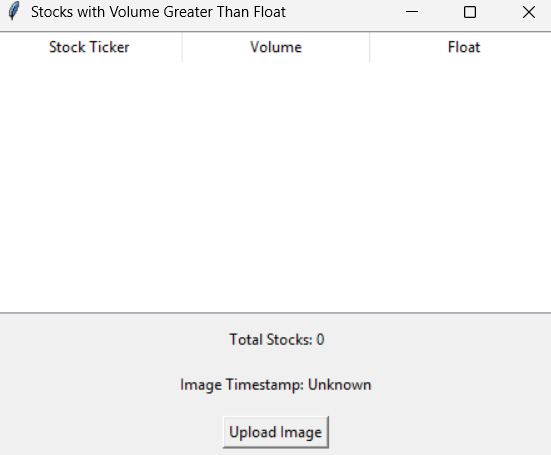

# Stock-ocr-gui
A GUI application for extracting stock information (ticker, volume, float) from images using Tesseract OCR. Features advanced image preprocessing and user-friendly results display.

# Stock OCR GUI Application

This project is a Python-based GUI application that extracts stock information (ticker, volume, float) from images using Tesseract OCR. It preprocesses images for better OCR accuracy, validates stock data, and displays results in an interactive table.

---

## Features
- **Image Preprocessing**: Converts images to grayscale, enhances contrast, and sharpens details for improved OCR performance.(screenshots/)
- **Stock Validation**: Extracts and filters stocks where volume > float.
- **Interactive GUI**: Built with Tkinter for a user-friendly experience.

---

## Setup Instructions

### Prerequisites
- Python 3.8+
- Tesseract OCR ([Download from here](https://github.com/tesseract-ocr/tesseract)).

### Install dependencies:

pip install -r requirements.txt

### Install Tesseract OCR:

- Download and install Tesseract from Tesseract GitHub Page.
- Update the path in main.py:
  
pytesseract.pytesseract.tesseract_cmd = r"C:\\Program Files\\Tesseract-OCR\\tesseract.exe".

### Run the application:

Python main.py

