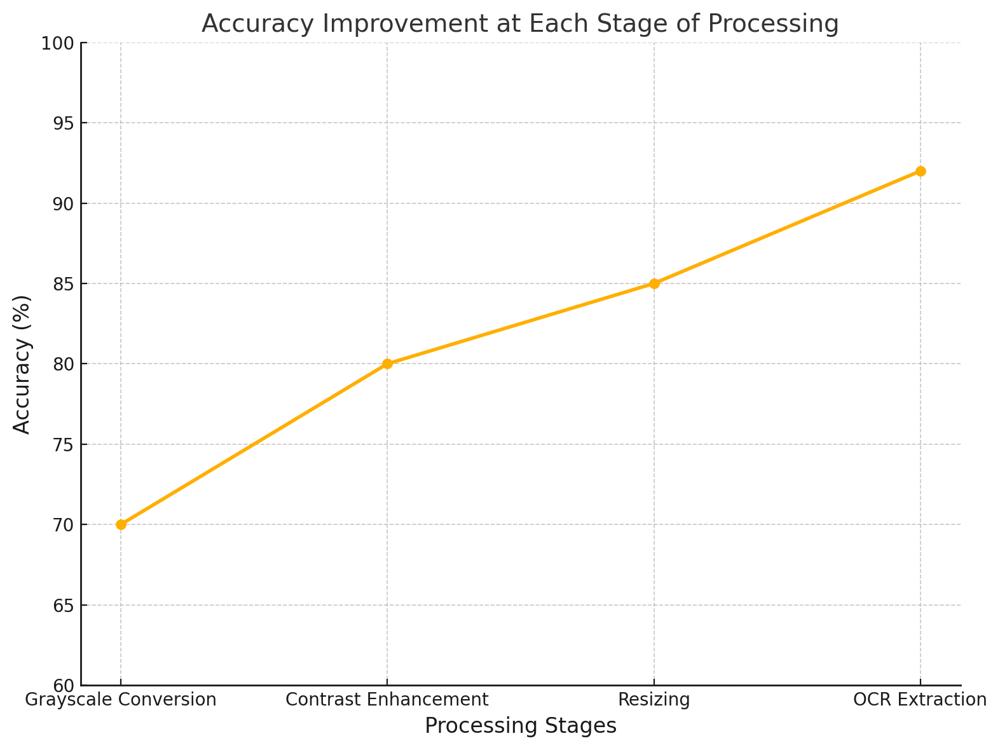

# Stock-ocr-gui
A GUI application for extracting stock information (ticker, volume, float) from images using Tesseract OCR. Features advanced image preprocessing and user-friendly results display.

# Stock OCR GUI Application

This project is a Python-based GUI application that extracts stock information (ticker, volume, float) from images using Tesseract OCR. It preprocesses images for better OCR accuracy, validates stock data, and displays results in an interactive table.

---

## Features
- **Image Preprocessing**: Converts images to grayscale, enhances contrast, and sharpens details for improved OCR performance.!

 [Raw Screenshot](screenshots/debug_final_preprocessed_image.png)
  
- **Stock Validation**: Extracts and filters stocks where volume > float.

[Stock Screenshot](screenshots/processed_image.png)

  
- **Interactive GUI**: Built with Tkinter for a user-friendly experience.

[Result Screenshot](screenshots/final.png)

---

## Setup Instructions

## How It Works
1. Upload an image file containing stock data.
2. The app preprocesses the image and extracts text using Tesseract OCR.
3. Results are displayed in a table format for easy viewing.

### Prerequisites
- Python 3.8+
- Tesseract OCR ([Download from here](https://github.com/tesseract-ocr/tesseract)).

### Install dependencies:

pip install -r requirements.txt

### Install Tesseract OCR:

- Download and install Tesseract from Tesseract GitHub Page.
- Update the path in main.py:
  
pytesseract.pytesseract.tesseract_cmd = r"C:\\Program Files\\Tesseract-OCR\\tesseract.exe".

### Run the application:

Python main.py

### Accuracy Graph:

Accuracy Improvement at Each Stage of Processing
This graph illustrates the progressive improvement in accuracy as each stage of image processing is applied. Starting from Grayscale Conversion, the accuracy increases as the image is enhanced through Contrast Adjustment and Resizing. The final stage, OCR Extraction, achieves the highest accuracy, reflecting the combined benefits of the preprocessing steps.

## License
This project is licensed under the [MIT License](LICENSE).
